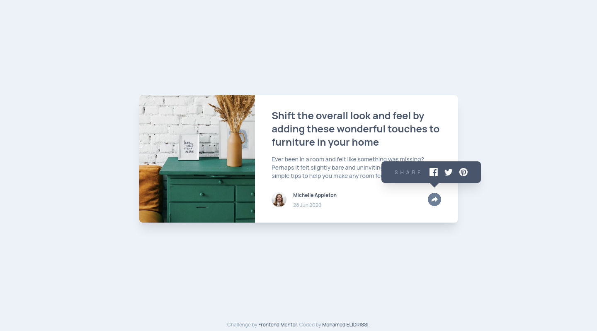

# Frontend Mentor - Article preview component solution

This is a solution to the [Article preview component challenge on Frontend Mentor](https://www.frontendmentor.io/challenges/article-preview-component-dYBN_pYFT). Frontend Mentor challenges help you improve your coding skills by building realistic projects. 

## Table of contents

- [Overview](#overview)
  - [The challenge](#the-challenge)
  - [Screenshot](#screenshot)
  - [Links](#links)
- [My process](#my-process)
  - [Built with](#built-with)
  - [What I learned](#what-i-learned)
  - [Continued development](#continued-development)
  - [Useful resources](#useful-resources)
- [Author](#author)
- [License](#license)

## Overview

### The challenge

Users should be able to:

- View the optimal layout for the component depending on their device's screen size
- See the social media share links when they click the share icon

### Screenshot

| Mobile (375px) | Mobile Share Menu (375px) | Desktop (1440px) |
| --- | --- | --- |
|  |  |  |

### Links

- [Solution URL](https://www.frontendmentor.io/solutions/article-preview-component-using-tailwind-css-and-fully-accessible-t09-t7GBu)
- [Live Site URL](https://article-preview-component-elidrissidev.vercel.app/)

## My process

### Built with

- Semantic HTML5 markup
- CSS custom properties
- Flexbox
- Mobile-first workflow
- [Tailwind CSS](https://tailwindcss.com/)
- [Parcel](https://parceljs.org/)

### What I learned

I learned more about accessibility in this challenge, a topic I'm always interested in. I learned about linking toggle buttons with the element they toggle: `aria-controls`, and how to indicate the current toggle state: `aria-pressed` and `aria-expanded`.

Apparently there was also a semantic HTML element for displaying dates and times `<time>`, it isn't auto-completed by Emmet on VSCode so I never knew it existed until now :D. 

### Continued development

On this challenge I spent a good chunk of time on the share menu especially the desktop one and although I ended up creating two menus and toggling their `display` property between mobile and desktop, I'd like to continue to learn about how I can better re-use mobile elements to style them for desktop without duplicating them, although sometimes duplicating them is the best/only option.

### Useful resources

- [Parent onClick is not triggered when the child element is clicked inside button](https://stackoverflow.com/a/43411649) - This answer helped me fix an annoying issue where the `<svg>` inside the share menu toggle button was being set as `event.target` when I click the button in the center (within the svg element's box). Setting `pointer-events: none` on the `svg` did the trick so now wherever I click on the button, `event.target` is always gonna be the button element.
- [How can I center an absolutely positioned element in a div?](https://stackoverflow.com/a/23384995) - This one trick I already knew and used in the past, but forgot about it and I used it to center the `absolute` share menu on desktop on top of the toggle button.

## Author

- Website - [Mohamed ELIDRISSI](https://www.elidrissi.dev)
- Frontend Mentor - [@elidrissidev](https://www.frontendmentor.io/profile/elidrissidev)

## Acknowledgments

This project is licensed under the [MIT License](LICENSE.txt).
